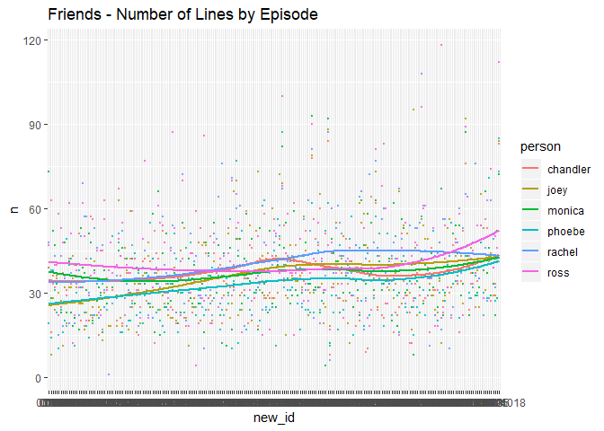

    ## Example
    
    Using this line, you can load the dataset. 
    
    
    ```r
    library(FriendsScripts)

## Here are some descriptive information about this dataset

### 1\. average number of scenes across all episodes

``` r
library(dplyr)
#> 
#> Attaching package: 'dplyr'
#> The following objects are masked from 'package:stats':
#> 
#>     filter, lag
#> The following objects are masked from 'package:base':
#> 
#>     intersect, setdiff, setequal, union
friends_lines %>%
  group_by(episodes_id) %>%
  summarize(max = max(scene2)) %>% ungroup() %>%
  summarize(avg_scenes = mean(max))
#> # A tibble: 1 x 1
#>   avg_scenes
#>        <dbl>
#> 1       13.5
```

### 2\. line count by episode

``` r
friends_lines %>% filter(type %in% c("person", "scene")) %>% count(episodes_id) %>% arrange(n)
#> # A tibble: 228 x 2
#>    episodes_id     n
#>    <chr>       <int>
#>  1 0911            2
#>  2 07            189
#>  3 0203          199
#>  4 0114          206
#>  5 0904          212
#>  6 0224          214
#>  7 0202          217
#>  8 0712          217
#>  9 0207          221
#> 10 0411          224
#> # ... with 218 more rows
```

### 3\. total number of scenes

``` r
friends_lines %>%
  group_by(episodes_id) %>%
  count(scene2) %>% 
  summarize(max = max(scene2)) %>% 
  arrange(max) %>% ungroup() %>%
  summarize(num_scenes = sum(max))
#> # A tibble: 1 x 1
#>   num_scenes
#>        <dbl>
#> 1       3083
```

## Data vitualizaiton

### 1\. Lines by episode over time

``` r
library(ggplot2)
main_char <- c("chandler", "ross", "monica", "phoebe", "joey", "rachel")
friends_lines %>% 
  filter(person %in% main_char) %>%
  count(person, episodes_id, sort = TRUE) %>%
  mutate(new_id = as.factor(episodes_id)) %>%
    ggplot(aes(x = new_id, y = n)) +
    geom_point(aes(colour = person), size = 0.5, alpha = 0.8) +
    geom_smooth(stat = "smooth", se = FALSE, method = "auto", aes(group = person, colour = person), alpha = 0.8) + 
    scale_fill_brewer(palette = "Dark2") +
    ggtitle("Friends - Number of Lines by Episode")
#> `geom_smooth()` using method = 'loess' and formula 'y ~ x'
```


